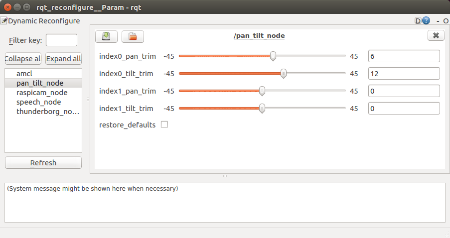

# pan_tilt

ROS node to control the position of two pan tilt devices. The node takes demands for Pan/Tilt position of a device and request the servo positions.

## Running the Node

Once you have the node built you can test it by launching the pan_tilt_test.launch file. This launch file also starts the serial_node as in my system the the actual control of the pan/tilt servos is done on a slave Arduino board.

## Node Information
Topics:

* `/pan_tilt_node/joints`:  
  Subscribes `sensor_msgs/JointState` with the pan and tilt positions for upto the four joints.

* `servo`:  
  Publishes `servo_msgs/servo_array` with the index of the servo (0-3) and the demand angle (in degrees) for the servo. This topic is latched.
 

Parameters:

* `/servo/index0/pan/servo`: Servo index for the pan servo of the first device. Default value = 0.

* `/servo/index0/tilt/servo`: Servo index for the tilt servo of the first device. Default = 1.

* `/servo/index1/pan/servo`: Servo index for the pan servo of the second device. Default value = 2.

* `/servo/index1/tilt/servo`: Servo index for the tilt servo of the second device. Default = 3.

* `/servo/index0/pan/flip_rotation`: true if the rotation of the pan servo on the first device should be flipped. Default = false

* `/servo/index0/tilt/flip_rotation`: true if the rotation of the tilt servo on the first device should be flipped. Default = false

* `/servo/index1/pan/flip_rotation`: true if the rotation of the pan servo on the second device should be flipped. Default = false

* `/servo/index1/tilt/flip_rotation`: true if the rotation of the tilt servo on the second device should be flipped. Default = false

* `/servo/index0/pan/max`: Maximum range for the pan servo of the first device. Default = pi/2.

* `/servo/index0/pan/min`: Minimum range for the pan servo of the first device. Default = -pi/2.

* `/servo/index0/tilt/max`: Maximum range for the tilt servo of the first device. Default = pi/2.

* `/servo/index0/tilt/min`: Minimum range for the tilt servo of first device. Default = -pi/2.

* `/servo/index1/pan/max`: Maximum range for the pan servo of second device. Default = pi/2.

* `/servo/index1/pan/min`: Minimum range for the pan servo of second device. Default = -pi/2.

* `/servo/index1/tilt/max`: Maximum range for the tilt servo of second device. Default = pi/2.

* `/servo/index1/tilt/min`: Minimum range for the tilt servo of second device. Default = -pi/2.

* `/servo/index0/pan/joint_name`: Name of pan joint on the first device. Default = reserved_pan0

* `/servo/index0/tilt/joint_name`: Name of tilt joint on the first device. Default = reserved_tilt0

* `/servo/index1/pan/joint_name`:  Name of pan joint on the second device. Default = reserved_pan1

* `/servo/index1/tilt/joint_name`: Name of tilt joint on the second device. Default = reserved_tilt1

## Trimming The Servos with dynamic reconfiguration

Due to the mechanical fittings of your pan/tilt device it may be off by a number of degrees. You can dynamically adjust the trim using rqt_reconfigure. Start this application with `rosrun rqt_reconfigure rqt_reconfigure`. It will bring up a user interface like the one shown below. Trim paramaters can be dynamically adjusted via the interface. 

Once you are happy with the trim values you can edit the default values in the cfg/pan_tilt.cfg file.
